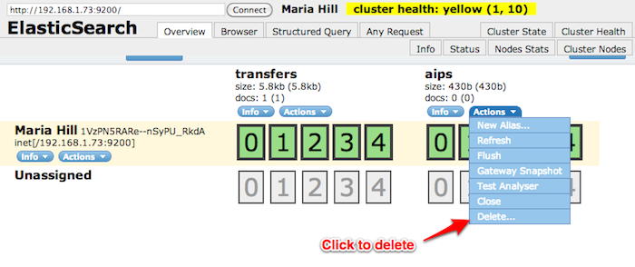

.. _admin-maintenance:

===========
Maintenance
===========

This page contains information releavant to maintaining your Archivematica
installation.

*On this page:*

* :ref:`Elasticsearch <elasticsearch>`

* :ref:`Programatic access to indexed AIP data <elasticsearch-access>`

* :ref:`Delete Elasticsearch index <elasticsearch-delete>`

* :ref:`Rebuild AIP or transfer index <elasticsearch-rebuild>`

* :ref:`Data backup <data-backup>`

* :ref:`FAQ <admin-faq>`

.. _elasticsearch:

Elasticsearch
-------------

Since version 0.9, Archivematica stores AIP file information, such as METS
data, using Elasticsearch. This data can be searched from the Archival Storage
area of the dashboard or can be interfaced with programmatically.

.. _elasticsearch-access:

Programatic access to indexed AIP data
^^^^^^^^^^^^^^^^^^^^^^^^^^^^^^^^^^^^^^

To access indexed AIP data using a custom script or application, find an
Elasticsearch interface library for the programming language you've chosen to
use. In Archivematica we use Python with the `pyes <https://github.com/aparo/pyes/>`_
library. In our developer documentation, we'll outline the use of pyes to access
AIP data, but any programming language/interface library, such as PHP and
`Elastica <https://github.com/ruflin/Elastica/>`_, should work.

**Connecting to Elasticsearch**

In this section we'll run through an example of interfacing with Elasticsearch
data using a Python script that leverages the pyes library.

The first step, when using pyes, is to require the module. The following code
imports pyes functionality on a system on which Archivematica is installed.

.. code:: bash

   import sys
   sys.path.append("/home/demo/archivematica/src/archivematicaCommon/lib/externals")
   from pyes import *

Next you'll want to create a connection to Elasticsearch.

.. code:: bash

   conn = ES('127.0.0.1:9200')

**Full text searching**

Once connected to Elasticsearch, you can perform searches. Below is the code
needed to do a "wildcard" search for all AIP files indexed by Elasticsearch
and retrieve the first 20 items. Instead of doing a "wildcard" search you
could also supply keywords, such as a certain AIP UUID.

.. code:: bash

   start_page     = 1
   items_per_page = 20

   q = StringQuery('*')

   try:
     results = conn.search_raw(
        query=q,
        indices='aips',
        type='aip',
        start=start_page - 1,
        size=items_per_page
     )
   except:
      print 'Query error.'

**Querying for specific data**

While the "StringQuery" query type is good for broad searches, you may want to
narrow a search down to a specific field of data to reduce false positives.
Below is an example of searching documents, using "TermQuery", matching
criteria within specific data. As, by default, Elasticsearch stores term
values in lowercase the term value searched for must also be lowercase.

.. code:: bash

   import sys
   sys.path.append("/usr/lib/archivematica/archivematicaCommon/externals")
   import pyes

   conn = pyes.ES('127.0.0.1:9200')

   q = pyes.TermQuery("METS.amdSec.ns0:amdSec_list.@ID", "amdsec_8")

   try:
       results = conn.search_raw(query=q, indices='aips')
   except:
     print 'Query failed.'

**Displaying search results**

Now that you've performed a couple of searches, you can display some results.
The below logic cycles through each hit in a results set, representing an AIP
file, and prints the UUID of the AIP the file belongs in, the Elasticsearch
document ID corresponding to the indexed file data, and the path of the file
within the AIP.

.. code:: bash

   if results:
       document_ids = []
       for item in results.hits.hits:
           aip = item._source
           print 'AIP ID: ' + aip['AIPUUID'] + ' / Document ID: ' + item._id
           print 'Filepath: ' + aip['filePath']
           print
           document_ids.append(item._id)

**Fetching specific documents**

If you want to get Elasticsearch data for a specific AIP file, you can use the
Elasticsearch document ID. The above code populates the document_ids array and
the below code uses this data, retrieving individual documents and extracting
a specific item of data from each document.

.. code:: bash

   for document_id in document_ids:
       data = conn.get(index_name, type_name, document_id)

       format = data['METS']['amdSec']['ns0:amdSec_list'][0]['ns0:techMD_list'][0]['ns0:mdWrap_list'][0]['ns0:xmlData_list'][0]['ns1:object_list'][0]['ns1:objectCharacteristics_list'][0]['ns1:format_list'][0]['ns1:formatDesignation_list'][0]['ns1:formatName']

       print 'Format for document ID ' + document_id + ' is ' + format

**Augmenting documents**

To add additional data to an Elasticsearch document, you'll need the document
ID. The following code shows an Elasticsearch query being used to find a
document and update it with additional data. Note that the name of the data
field being added, "__public", is prefixed with two underscores. This practice
prevents the accidental overwriting of system or Archivematica-specific data.
System data is prefixed with a single underscore.

.. code:: bash

   import sys
   sys.path.append("/usr/lib/archivematica/archivematicaCommon/externals")
   import pyes

   conn = pyes.ES('127.0.0.1:9200')

   q = pyes.TermQuery("METS.amdSec.ns0:amdSec_list.@ID", "amdsec_8")

   results = conn.search_raw(query=q, indices='aips')

   try:
     if results:
       for item in results.hits.hits:
           print 'Updating ID: ' + item['_id']

           document = item['_source']
           document['__public'] = 'yes'
           conn.index(document, 'aips', 'aip', item['_id'])
   except:
     print 'Query failed.'

.. _elasticsearch-delete:

Delete Elasticsearch index through GUI
^^^^^^^^^^^^^^^^^^^^^^^^^^^^^^^^^^^^^^

To help with Elasticsearch development, Archivematica comes with a plugin for
Elasticsearch, called
`Elasticsearch Head <http://mobz.github.com/elasticsearch-head/>`_, that
provides a web application forcbrowsing and administering Elasticsearch data. \
It can be accessed at http://your.host.name:9200/_plugin/head/.

Elasticsearch Head will allow you to delete an index, if need be.

Delete Elasticsearch index programmatically
^^^^^^^^^^^^^^^^^^^^^^^^^^^^^^^^^^^^^^^^^^^

If, for whatever reason, you need to delete an Elasticsearch index
programmatically, this can be done with pyes using the following code.

.. code:: bash

   import sys
   sys.path.append("/home/demo/archivematica/src/archivematicaCommon/lib/externals")
   from pyes import *
   conn = ES('127.0.0.1:9200')

   try:
       conn.delete_index('aips')
   except:
       print "Error deleting index or index already deleted."

.. _elasticsearch-rebuild:

Rebuilding the AIP index
^^^^^^^^^^^^^^^^^^^^^^^^

To rebuild the ElasticSearch AIP index enter the following to find the
location of the rebuilding script:

.. code:: bash

   locate rebuild-elasticsearch-aip-index-from-files

Copy the location of the script then enter the following to perform the
rebuild (substituting "/your/script/location/rebuild-elasticsearch-aip-index-
from-files" with the location of the script):

.. code:: bash

   /your/script/location/rebuild-elasticsearch-aip-index-from-files <location of your AIP store>

Rebuilding the transfer index
^^^^^^^^^^^^^^^^^^^^^^^^^^^^^

Similarly, to rebuild the ElasticSearch transfer data index enter the
following to find the location of the rebuilding script:

.. code:: bash

   locate rebuild-elasticsearch-transfer-index-from-files

Copy the location of the script then enter the following to perform the
rebuild (substituting "/your/script/location/rebuild-elasticsearch-transfer-
index-from-files" with the location of the script):

.. code:: bash

   /your/script/location/rebuild-elasticsearch-transfer-index-from-files <location of your AIP store>

.. seealso::

   `Elasticsearch troubleshooting <https://www.accesstomemory.org/en/docs/2.1/admin-manual/maintenance/elasticsearch/#maintenance-elasticsearch>`_
   help from AtoM documentation.

.. _data-backup:

Data back-up
------------

In Archivematica there are three types of data you'll likely want to back up:

* Filesystem (particularly your storage directories)

* MySQL

* ElasticSearch

MySQL is used to store short-term processing data. You can back up the MySQL
database by using the following command:

.. code:: bash

   mysqldump -u <your username> -p<your password> -c MCP > <filename of backup>

ElasticSearch is used to store long-term data. Instructions and scripts for
backing up and restoring ElasticSearch are available
`here <http://tech.superhappykittymeow.com/?p=296>`_.

.. _admin-faq:

FAQ
---

.. _restart-services:

How to restart the Archivematica services
^^^^^^^^^^^^^^^^^^^^^^^^^^^^^^^^^^^^^^^^^

**Restart all services**

.. code:: bash

   am services

Note that the default action is to restart all services. To see other available
parameters, type

.. code:: bash

   am services help

**Stopping**

.. code:: bash

   sudo stop archivematica-mcp-server
   sudo stop archivematica-mcp-client
   sudo /etc/init.d/apache2 stop
   sudo /etc/init.d/gearman-job-server stop
   sudo stop mysql
   sudo /etc/init.d/elasticsearch stop

**Starting**

.. code:: bash

   sudo /etc/init.d/elasticsearch start
   sudo start mysql
   sudo /etc/init.d/gearman-job-server start
   sudo /etc/init.d/apache2 start
   sudo start archivematica-mcp-server
   sudo start archivematica-mcp-client

.. _stack-trace:

Error stack trace
^^^^^^^^^^^^^^^^^

"I am getting a white error page in the Dashboard. How can I find out what the
error is?"

Seeing an full error stack trace for the Dashboard requires knowing how to
edit a configuration file from the command line.

1. SSH to the Archivematica server

2. With your preferred text editor, open the dashboard settings file (vim shown
   in example; Note that you must use sudo to edit this file):

.. code:: bash

    sudo vim /usr/share/archivematica/dashboard/settings/common.py

3. Change the "DEBUG" flag from "False" to "True"

.. code:: bash

    DEBUG = True

4. Save the file

5. Restart Apache

.. code:: bash

    sudo apache2ctl restart

6. Reload the dashboard page reporting the error in your browse

7. Debug or report error

8. Restore DEBUG to False and restart Apache to turn error reporting off again

.. _browser compatibility:

Browser compatability
^^^^^^^^^^^^^^^^^^^^^

Archivematica has been tested most extensively with Firefox and Chrome. There are
known issues with Internet Explorer 11 which result in an inability to start
transfers in the dashboard (`Issue 7246 <https://projects.artefactual.com/issues/7246>`_). Minimal, but successful,
testing has been done with Microsoft Edge.

:ref:`Back to the top <maintenance>`
