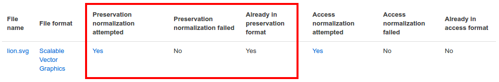
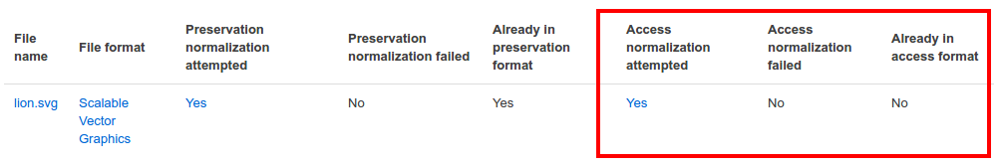

.. _quick-start:

===============================
Archivematica Quick-Start Guide
===============================

This guide will walk you through the Archivematic a transfer and ingest process for
testing purposes. It is intended for people who are new to Archivematica and who
are looking to test it out. This is not a guide to install Archivematica for development
or production - please see :ref:`Installation <installation>` for full installation
instructions. Before you start, you should know a bit about the `OAIS reference model
<http://www.oclc.org/research/publications/library/2000/lavoie-oais.html>`_
- enough that the acronyms SIP, AIP, and DIP make sense.

This guide presents a standard, simple transfer and does not go into detail about
Archivematica's advanced features. For information about processing more
complex content, see the :ref:`User manual <user-manual>`. The instructions below
are applicable to both the sandbox and an Archivematica virtual machine, unless
otherwise noted.

By the end of this walkthrough, you should be able to:

* Create a standard transfer in Archivematica
* Create an AIP and a DIP from the transfer
* Review file identification
* Review file normalization
* Automate an Archivematica pipeline

*On this page:*

* :ref:`Task #0 - Set up your Archivematica test instance <quick-start-install>`
* :ref:`Task #1 - Start a standard transfer <quick-start-transfer>`
* :ref:`Task #2 - Make AIPs and DIPs <quick-start-ingest>`
* :ref:`Task #3 - Store AIPs and DIPs <quick-start-storage>`
* :ref:`Task #4 - Review AIPs and DIPs <quick-start-review>`
* :ref:`Task #5 - Automate workflow through configuration <quick-start-config>`
* :ref:`More ways to get familiar with Archivematica <quick-start-resources>`

.. _quick-start-install:

Task #0 - Set up your Archivematica test instance
-------------------------------------------------

If you do not have access to a full installation of Archivematica, there are two
options for testing the software - the hosted Archviematica sandbox or a locally-installed
Archivematica VM.

Using the sandbox
=================

Artefactual maintains an `Archivematica sandbox <sandbox.archivematica.org>`_ with the
following credentials:

* Username: demo@example.com
* Password: demodemo

The sandbox is provided as an easy way to test the latest release of the Archivematica.
Please note that the website will automatically reset daily. Any packages that you
create will not be permanently saved. Additionally, there may be more than one demo
user logged-in at the same time, so you may see changes made by others while you
are using the software.

The demo site is publicly edited and unmoderated. For reasons of security, test
transfers are limited to Artefactual's provided sample data. Users who wish to
test using their own data may download the Vagrant box (described below) and test
locally.

.. note::

  If you are using the sandbox, you can move on to Task #1.

Installing on a virtual machine
===============================

It is possible to deploy Archivematica on a virtual machine. Users may want to do
this in order to test Archivematica's functionality using their own data. The
recommended way to install Archivematica on a virtual machine is with Ansible and
Vagrant.

To install and run Archivematica on a virtual machine, you must be somewhat
comfortable working on the command line. Note that the commands below are for Ubuntu; if you are
installing on Mac or a different Linux distribution, the commands might be slightly different.
The installation has not been tested on Windows.

Open your terminal and install VirtualBox, Vagrant, and Ansible with the following commands::

  sudo apt-get install virtualbox vagrant

  sudo pip install -U ansible

Vagrant must be at least version 1.5. Check your version with::

  vagrant --version

If it is not up to date, you can download the newest version from the `Vagrant website <https://www.vagrantup.com/downloads.html>`_ .

The deployment repository is the source code from which you will be building your
local Archivematica instance. Check out the deployment repository::

  git clone https://github.com/artefactual/deploy-pub.git

Ansible roles govern deployment - they tell the software how Archivematica should
be built. Download the Ansible roles::

  cd deploy-pub/playbooks/archivematica

  ansible-galaxy install -f -p roles/ -r requirements.yml

Now that you have the source code and the rules for building Archivematica, it's
time to start building. This step will create your virtual machine and build, or
provision, Archivematica::

  vagrant up

.. warning::

  This will take a while. It depends on your computer, but it could take up to an
  hour. Your computer may be very slow while Archivematica is being provisioned - be
  sure to save any work and be prepared to step away from your computer while
  Archivematica is building.

Once it's done provisioning, you can log in to your virtual machine::

  vagrant ssh

You may also now access your Archivematica instance through the web browser:

* Archivematica: `<http://192.168.168.192>`_. Username: demo@example.com, password: demo.
* Storage Service: `<http://192.168.168.192:8000>`_. Username: test, password: test.

To get the Storage Service API key, go to `<http://192.168.168.192:8000>`_
and click on the Administration tab. In the left sidebar, click on *Users*, then
click on *Edit* for the default user. Scrolling down, you will see the API key for
the default user at the bottom of the screen. Copy this into the

.. _quick-start-transfer:

Task #1 - Start a standard transfer
-----------------------------------

A Transfer is any set of one or more files that you decide to process as a group.
They can come from any storage system that Archivematica has been hooked up to.
To start your first transfer, go to the Archivematica transfer dashboard - the main page
of either the `sandbox <sandbox.archivematica.org>`_ or your
`Archivematica VM <http://192.168.168.192>`_. You can also access the transfer page
by clicking on the Transfer tab in your Archivematica instance.

The transfer process is made up of a series of micro-services, which are in turn
made up of jobs. A micro-service is a group of actions that accomplish a specific
goal within Archivematica, like verifying that your transfer complies with Archivematica's
transfer requirements. Jobs are discreet actions, like moving the contents of your transfer
to a processing directory. Each micro-service can be expanded if you click on the
micro-service name. This allows you to see every job that makes up the
micro-service. You can view the command for each job by clicking on the gear icon
to the right of each job name. This will open a new window that lists the command
information; clicking on *Show arguments* will list the exact python command that
Archivematica uses to run the job. Jobs turn green when they complete successfully
and red if they fail.

**Steps:**

#. Make sure ‘Standard’ is selected in the transfer type box.
#. Type in a name for your transfer (anything you like).
#. Click on browse to look through the available content. Make sure to click on the folder icon to expand the directory trees.
#. Find the *images* directory in SampleTransfers and click Add.
#. The selected directory will be displayed below the selection box.
#. Click on the green *Start transfer* button to start the transfer.
#. When prompted, make decisions as you wish; however, don't select anything that would stop the transfer (i.e. anything that says "Reject"). For more information about the decision points, check out the :ref:`transfer tab documentation <transfer>`.
#. When you reach the *Identify file format* micro-service, stop and read the next section.

Review file formats
===================

You do not need to consult the command for every job, but we do recommend taking a
look at the output of the *Identify file format* micro-service. One of Archivematica's
primary jobs is to identify file formats and then preserve those files as best as
possible.

**Steps:**

#. When you are prompted, select a file format identification tool (Seigfried and Fido are the most robust options).
#. Once file format identification is complete, click on the gear icon to the right of the job name to open the job page.
#. On the job page, under the heading STDOUT, you will see information similar to the following:

.. code-block:: none

  IDCommand UUID: 8cc792b4-362d-4002-8981-a4e808c04b24
  File: (9305a71e-5180-4c49-b93e-c934d7a433dc) /var/archivematica/sharedDirectory/currentlyProcessing/demo-test-f706d98d-faa6-450f-92c7-b608f1106f2e/objects/pictures/MARBLES.TGA
  fmt/402

  Command output: fmt/402
  /var/archivematica/sharedDirectory/currentlyProcessing/demo-test-f706d98d-faa6-450f-92c7-b608f1106f2e/objects/pictures/MARBLES.TGA identified as a Truevision TGA Bitmap 2.0

The above tells us that the file MARBLES.TGA was identified as a Truevision TGA
Bitmap 2.0. Archivematica uses `PRONOM <https://www.nationalarchives.gov.uk/PRONOM/Default.aspx>`_,
a registry of technical information maintained by the National Archives of the UK,
for file identification and to inform normalization, characterization, and other
file-manipulation events. Archivematica identifies a TGA file as
`fmt/402 <https://www.nationalarchives.gov.uk/PRONOM/fmt/402>`_ (format 402),
which is the PRONOM format identifier for a Truvision TGA Bitmap 2.0. There should be
a similar STDOUT section for each item in your transfer.

Archivematica will continue processing your transfer in the background. When you reach the *Create SIP from Transfer micro-service*, read the next section.

Create a SIP
============

The final micro-service on the Transfer tab is *Create SIP from Transfer*. The
final job, *Create SIP(s)*, allows you to either proceed directly to the Ingest
tab or to send the transfer to the backlog. For more information on the backlog,
check out the :ref:`backlog documentation <manage-backlog>`.

**Steps:**

#. When prompted, select *Create single SIP and continue processing*.

.. _quick-start-ingest:

Task #2 - Make AIPs and DIPs
----------------------------

The primary function of Archivematica is to produce Archival Information Packages
from the content that you selected on the Transfer tab. The Ingest tab is where
the AIP is created.

**Steps:**

#. Click on the Ingest tab.
#. Make decisions as required (again, don't select anything that says "Reject"). For more information about the decision points that appear during ingest, check out the :ref:`ingest tab documentation <ingest>`.
#. When you get to the Normalize decision point, stop and read the next section.

Normalization
=============

Ingest, like Transfer, is also made up of a series of micro-services. The most
significant micro-service that takes place during ingest is Normalize. Normalization
is the process of converting your digital content into appropriate formats for long-term
storage (for an AIP) and access (for a DIP). When you reach the Normalization micro-service,
you will be prompted to decide how you would like to normalize your content.

**Steps:**

#. When prompted, select *Normalize for preservation and access*. By selecting this option, you are telling Archivematica that you would like to create a preservation copy (AIP) and an access copy (DIP) of the contents of your SIP.
#. Once normalization is complete, you will be prompted to approve normalization. Before selecting approve, click on the small page icon next to the drop down menu.
#. The Normalization Report will open in a separate tab. Information on how to read this report is included below.
#. In your main tab, click on the Preservation Planning tab at the top of the page. When the Preservation Planning tab is open, search for "SVG" (or whatever file format you would like to review). Click on the name of the file format.
#. You should now have two tabs open - the Normalization Report and the Preservation Planning page. Go back to the Normalization Report and review the next two sections.

Reviewing normalization for preservation
++++++++++++++++++++++++++++++++++++++++

The Normalization Report details whether or not normalization was attempted on the
contents of your SIP. This screenshot shows the report for lion.svg, identified
as a Scalable Vector Graphic, with the preservation columnns highlighted.

If you return to the Preservation Planning tab where you searched for SVG, you can
see that SVG files are considered a preservation format. Therefore, the Normalization
Report indicates the following:

* Preservation normalization was attempted.
* Preservation normalization did not fail.
* The image was already in a preservation format.

Essentially, this means that preservation normalization kicked off, but Archivematica
realized that the file was already in a preservation format and so no action was taken.

Reviewing normalization for access
++++++++++++++++++++++++++++++++++

This screenshot shows the report for lion.svg with the access columnns highlighted.

For access normalization, the report indicates the following:

* Access normalization was attempted.
* Access normalization did not fail.
* The image was not in an access format.

To review what this means for lion.svg, we'll dig a little deeper into the Preservation
Planning tab.

**Steps:**

#. Navigate back to the Preservation Planning tab.
#. Scroll down and find the *Normalization* section in the left-hand sidebar. Click on *Rules*.
#. Search for "Scalable Vector Graphics" (or whatever file format you are analyzing).

The results show the Access and Normalization rules for SVG files. Under the Command
column, we can discover that the preferred access format for an SVG is PDF. Archivematica
follows these rules to create access copies, so we can infer from the Normalization Report
that a PDF copy of the SVG file has been successfully created for the DIP. You can
also confirm this by checking the command output for the *Normalize for access* job
(similar to how you checked the command output for *Identify file format*, above) or
by reviewing the DIP once it has been stored.

Continue processing your ingest stopping when you reach the AIP and DIP decision points.

.. _quick-start-storage:

Task #3 - Store AIPs and DIPs
-----------------------------

Archivematica is a tool for creating packages. In a production environment, storage
occurs external to Archivematica in a storage system selected by the user or institution,
but for the sake of this demo we'll store our AIP and DIP in Archivematica's default
internal storage.

AIPs should always be stored first. Because the packages are smaller, storage options
for DIPs are usually the first to appear, so it's tempting to store them right away.
However, if anything goes wrong with your AIP, you would then have to delete the DIP
from the storage and access systems. Dealing with the AIP first allows you to store
and provide access to DIPs with confidence that the AIP is secure.

**Steps:**

#. Process your ingest until the *Store AIP* and *Upload DIP* micro-services to prompt you for a decision point.
#. Select "Store AIP" from the *Store AIP* dropdown.
#. In a moment, another decision point will prompt you to select a storage location for your AIP. There should only be one option - "Store AIP in standard Archivematica directory". Select this option.
#. Once the AIP is stored successfully, you can move on to dealing with the DIP. Neither a locally-installed Archivematica VM nor the sandbox is hooked up to an access system, so under *Upload DIP* select "Store DIP".
#. You will be prompted to select a storage location for your DIP. There should only be one option - "Store DIP in standard Archivematica directory". Select this option.

Your AIP and DIP are now stored in Archivematica's internal storage. The Archivematica
workflow is complete!

.. _quick-start-review:

Task #4 - Review AIPs and DIPs
------------------------------

Now that your AIP and DIP have been stored, they can be reviewed.

Review AIP
==========

**Steps:**

#. Click on the Archival Storage Tab. You should see your AIP listed in the search results there, but if not, you can search for it using the name you gave it in Task #1.
#. Depending on the version of Archivematica you are using, clicking on the name of the AIP will either open the AIP Details page or immediately download the AIP. If you end up on the AIP Details page, click on the ‘download’ button.
#. Once it's downloaded, open the AIP. You will need to a program capable of opening 7zip files installed on your computer. If required, you can download 7Zip here: http://www.7-zip.org/download.html
#. Once you have the AIP extracted, navigate through the folders until you find the objects directory. This directory contains the original images from your transfer as well as the preservation copies. You can compare the file formats in the objects directory to the rules in the Preservation Planning tab.
#. Navigate through the folders until you find the METS file and open it in a web browser or text editor. It will be titled something like "METS.7e58760a-e357-4165-9428-26f5bb2ba8ee.xml".
#. Find the <mets:fileSec> tag in the METS. Within the fileSec, you should be able to find information about every item in your original transfer - these are in the section tagged <mets:fileGrp USE="original">. Scrolling down, you can view complementary information for each of the preservation copies - this is in the section tagged <mets:fileGrp USE="preservation">.

The METS.xml file is very long, because it contains all of the information about your
files as well as information about the processes and tools that acted on those original
files. For more information about the contents and structure of the METS file, check out the `Archivematica wiki <https://wiki.archivematica.org/METS>`_.

Review DIP
==========

.. note::

  This section is only applicable to those using a VM as the Archivematica sandbox does not allow access to the Storage Service.

**Steps:**

#. In order to retrieve the DIP, you need to access the Archivematica Storage Service. Add ":8000" to the end of your Archivematica VM's URL (i.e. http://192.168.168.192:8000/). The default login is test/test.
#. In the Storage Service, click on the Packages tab.
#. On the far right side of the page, there is a search box. Search for your DIP by entering the name you gave it in Task #1.
#. You should see two results. One is your AIP and the other is the DIP. This is indicated under the "Type" column.
#. Once you've identified which file is your DIP, click on "Download".
#. Once it's downloaded, open the DIP. You will need to a program capable of opening tar files installed on your computer. 7Zip, mentioned above, can open TAR files: http://www.7-zip.org/download.html
#. Once you have the DIP extracted, open the objects directory. This directory contains the access copies derived from your original images. You can compare the file formats in the objects directory to the rules in the Preservation Planning tab.
#. The DIP also contains a thumbnails directory, which has small JPG versions of your images. If the image could not be converted to a JPG (as is the case with an SVG file), a generic icon is included instead.

.. _quick-start-config:

Task #5 - Automate workflow through configuration
-------------------------------------------------

Clicking on the Administration tab opens up Archivematica's processing configurations
screen. This is the most basic way of automating Archivematica. Each of the decision
points that you encountered during the Archivematica test that you ran, above, can
be automated on this page. This is mostly used if you know you will be making the
same decision each time you encounter a decision point.

**Steps:**

#. Click on the Administration tab. You should see a single processing configuration listed, called ‘default’.
#. Review the different options and select as many defaults as you would like. You should recognize the options from the decision points you made during previous tasks.

For example, you may want to automate the compression algorithm and level, because
you always want to use the same compression tool and you always want to compress
packages at the same rate. To set the compression-related processing configurations:

#. Check the box next to *Select compression algorithm*.
#. Using the dropdown to the right, select a compression algorithm - *7z using bzip2* is the most common.
#. Check the box next to *Select compression level*
#. Using the dropdown to the right, select a compression level - *5 - normal compression mode* is a good balance between speed and size.

We recommend that you run several tests in Archivematica before setting
up the processing configurations. As you become more familiar with Archivematica,
you will begin to recognize which decisions you make over and over again; these
are great candidates for automation via the processing configurations.

.. _quick-start-resources:

More ways to get familiar with Archivematica
--------------------------------------------

This tutorial covers a very basic Archivematica workflow. For information about processing more
complex content, see the :ref:`User manual <user-manual>`.

The tasks above are based on the Archivematica Worksheet first developed by Justin
Simpson for the HEAP-AIM25 Network Meeting in November 2016. The worksheet runs
through several more examples of Archivematica workflows. It is available for download
via the `Archivematica Camp Github repo <https://github.com/artefactual-labs/archivematica-camp>`_.
Feel free to use this worksheet for personal use or in a teaching context - see the
licence file in the repo.

:ref:`Back to the top <quick-start>`
