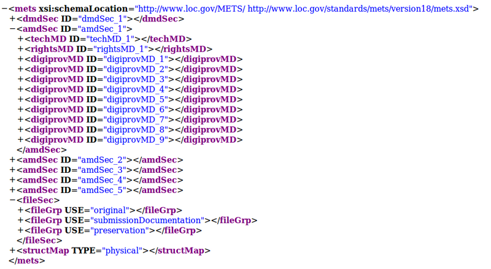

.. _aip-structure:

=============
AIP structure
=============

This page documents the structure of the AIP produced by Archivematica.

Name
----

The AIP name is composed of the following:

1. Either the name of the original transfer if no new name has been assigned to the SIP upon formation or the name of the SIP or SIPs created from the transfer.
2. A UUID assigned during SIP formation.
   
For example: AncientSturgeon-bbabce6e-OO16-4185-a93e-f2dd71bfbb8c

   "AncientSturgeon" is the name assigned by the user and "bbabce6e-OO16-4185-a93e-f2dd71bfbb8c" is the UUID generated during SIP formation.

Directory structure
-------------------

The AIP is zipped in the AIPsStore. The AIP directories are broken down into
UUID quad directories for efficient storage and retrieval.

.. figure:: images/AIPStructureZipped.*
   :align: center
   :figwidth: 70%
   :width: 100%
   :alt: AIP directory - top level

   AIP directory - top level

.. note::

   UUID quad directories: Some file systems limit the number of items allowed in
   a directory, so Archivematica uses a directory tree structure to store AIPs.
   The tree is based on the AIP UUIDs. The UUID is broken down into manageable 4
   character pieces, or "UUID quads", each quad representing a directory. The
   first four characters (UUID quad) of the AIP UUID will compose a sub directory
   of the AIP storage. The second UUID quad will be the name of a sub directory
   of the first, and so on and so forth, until the last four characters (last
   UUID Quad) create the leaf of the AIP store directory tree, and the AIP with
   that UUID resides in that directory.)

The Archivematica AIP consists of Bagit files and a Data directory.

Bagit documentation
^^^^^^^^^^^^^^^^^^^

The AIP is packaged in accordance with the Library of Congress Bagit specification (PDF, 84KB) As shown below, the BagIt files are bag-info.txt, bagit.txt, manifest-sha256.txt and tagmanifest-md5.txt:

.. image:: images/AIPStructureBagit.*
   :align: center
   :width: 70%
   :alt: Bagit specification files

The following describes the contents of the AIP once extracted:

**Data directory**

The data directory consists of the METS file for the AIP, a README.html file and three folders:
logs, objects. and thumbnails.

.. figure:: images/AIPStructureDataDirectory.*
   :align: center
   :figwidth: 70%
   :width: 100%
   :alt: AIP data directory

   AIP data directory

**METS file**

``/data/METS.uuid.xml`` contains the full `PREMIS <https://www.loc.gov/standards/premis/>`_
implementation (see PREMIS metadata for original file, PREMIS metadata:
normalized files, PREMIS metadata: events, and PREMIS metadata: rights). The
role of the `METS file <https://wiki.archivematica.org/METS>`_ is to link
original objects to their preservation copies and to their descriptions and
submission documentation, as well as to link PREMIS metadata to the objects in
the AIP.

**METS file structure**

The METS file will have a basic generic structure that will be present for all AIPs derived from different kinds of transfers. Archivematica currently uses METS version 1.11.

``<dmdSec>``

    * There may be one dmdSec for the AIP as a whole. Each original file may also have a dmdSec.
    * The dmdSecs are numbered dmdSec_1, dmdSec_2 etc.
    * The dmdSec contains Dublin Core metadata. If the user does not enter any DC metadata during transfer/ingest and no DC metadata was included in the transfer (eg as part of a DSpace export), there will be no dmdSec.
    * The dmdSec may contain a reference to metadata in another file, such as a mets.xml file included in a DSpace export. 

``<amdSec>``

    * There is one amdSec for each object.
    * The amdSecs are numbered amdSec_1, amdSec_2 etc.
    * Each amdSec will include one techMD and multiple digiprovMDs
    * An amdSec for an original object may also contain one or more rightsMDs. The rightsMD may contain a reference to metadata in another file, such as a mets.xml file included in a DSpace export. 

``<fileSec>``

    * There is one fileSec listing all files.
    * The fileSec is organized into the following fileGrps:
         * original
         * preservation
         * service
         * access
         * submissionDocumentation
         * license
         * text/ocr 
    * Original is required for all METS files.
    * SubmissionDocumentation is included if the AIP includes submission documentation.
    * Preservation is included if the AIP includes normalized files.
    * Service and access may be used if the AIP contains those subfolders - i.e as the output of digitization workflows.
    * License and text/ocr are used if the AIP was created from a DSpace export containing licenses and ocr text files. 

``<structMap>``

    * As of Archivematica 1.7 there are two structMaps:
         * The first is labeled "Archivematica Default" and shows the physical layout of the files in the objects directory. 

         * The second is labeled "Normative Directory Structure" which shows the logical structure of the files in the objects directory. This second structMap is necessary to document empty directories before they are deleted at 'store AIP' in the Storage Service. At AIP re-ingest the new logical structMap will be parsed to re-create the empty directories.  

**README.html file**

``/data/README.html`` consists of a human readable file that describes the basic structure
of an Archivematica AIP.  It consists of Acronyms, Introduction, Content Information,
Preservation Description Information (PDI), and AIP structure.

**Logs**

``/data/logs`` contains the /transfers directory, format identification log, malware scan
log, and the file name cleanup log generated during SIP creation.

.. figure:: images/AIPStructureDataLogs.*
   :align: center
   :figwidth: 70%
   :width: 100%
   :alt: Logs folder content in Data

   Logs folder content in Data

The ``/transfers`` directory contains the logs from processing that occurred
to each transfer which is part of the SIP in the transfer workflow in the
dashboard.

**Objects**

``/data/objects`` contains original objects, normalized objects, ``/metadata`` and
``/submissionDocumentation``. If there were any lower level directories within
the SIP, that directory structure is maintained.

.. figure:: images/AIPStructureObjectsFolder.*
   :align: center
   :figwidth: 70%
   :width: 100%
   :alt: Objects folder content in Data

   Objects folder content in Data

``/metadata`` contains ``/transfers``, which contains any metadata which may have
been imported with the transfers

``/submissionDocumentation`` contains submission documentation for each
transfer which is part of the SIP and each transfer's METS.xml file. The
structmap for the transfer is the closest approximation of original order
for the transfer, along with the tree diagram if the user chose to create one
during transfer.

**Thumbnails**

``/data/thumbnails`` contains any thumbnails generated for viewing in the AIP
search interface of the dashboard.

:ref:`Back to the top <aip-structure>`
